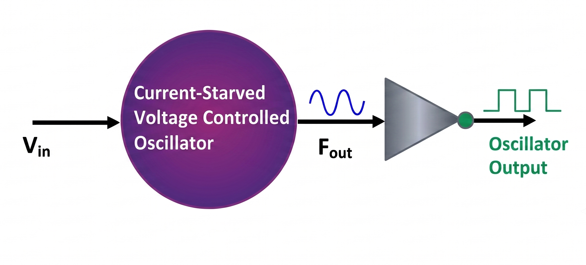

# VCO-Based ADC in 90nm CMOS for Biomedical Applications

Comparative performance evaluation of a current-starved ring-VCO-based ADC, ported from a 130nm reference design to 90nm CMOS, with a projected 45nm scaling analysis. Targeted at low-power implantable/wearable biomedical applications (pacemakers, neural implants, WBAN).

> **Note on tooling:** This project was designed and simulated in Cadence Virtuoso against a foundry 90nm CMOS PDK. Neither the tool nor the PDK can be redistributed here due to licensing/NDA restrictions. This repo contains the architecture, equations, figures, and results from the work, plus a from-scratch design guide so the circuit can be reproduced by anyone with their own Cadence + PDK access. See [`Guide_Report.pdf`](Guide_Report.pdf).

## Architecture

The ADC performs indirect time-domain conversion in two stages:

1. **Voltage-to-Frequency Converter (VFC)** — a 5-stage current-starved ring VCO converts the input voltage `Vin` into an oscillation frequency `fout`, per:

   ```
   fout(Vin) = f0 + KVCO · Vin
   ```

2. **Frequency-to-Digital Converter (FDC)** — a 4-bit asynchronous ripple counter (built from NAND-based D flip-flops) counts VCO edges within each sampling window `Ts = 1/fs`, producing the digital output word:

   ```
   N = floor(fout(Vin) · Ts)
   ```

```
Vin → [5-stage current-starved ring VCO] → fout → [4-bit async reset counter] → Digital Code (D1–D4)
```
The complete system architecture, from voltage input to digital output, is illustrated below:

<p align="center">
  
</p>

## Key Results (90nm, this work)

| Vin (V) | fout | Digital Output |
|---|---|---|
| 0.4 | ~160 MHz | 0001 |
| 0.6 | ~230 MHz | 0110 |
| 0.8 | ~330 MHz | 1011 |
| 1.0 | ~470 MHz | 1101 |

## Technology Comparison

| Parameter | 130nm (Ellaithy, ref.) | 90nm (this work) | 45nm (predicted) |
|---|---|---|---|
| Supply V_DD | 1.2 V | 1.2 V | 1.0 V |
| VCO f_min | 100 MHz | 160 MHz | 130 MHz |
| VCO f_max | 1.6 GHz | 470 MHz | 350 MHz |
| Sampling rate f_s | 100 MHz | 60 MHz | 50 MHz |
| Resolution | 4-bit | 4-bit | 4-bit |
| Power | 0.257 mW | 0.214 mW | 0.198 mW |
| Active area | 0.007 mm² | ~0.0033 mm² | ~0.0018 mm² |
| SNDR | 62 dB | 65 dB | 68 dB |
| Walden FoM | 125 fJ/step | 105 fJ/step | 62 fJ/step |

Moving from 130nm → 90nm/45nm follows standard CMOS scaling relations (feature size `S = 130/90 ≈ 1.44`, `C ∝ 1/S`, `V_DD ∝ √(1/S)`), giving `f_osc,90nm ≈ 1.44 × f_osc,130nm` and `P_90nm ≈ 0.693 × P_130nm` — real power/area gains with no architectural changes.

## Repo Structure

```
vco-adc-90nm/
├── README.md
├── paper/                  # full manuscript (PDF)
├── figures/                 # schematics & simulation waveforms exported from Virtuoso
│   ├── fig1_vfc_block.png
│   ├── fig3_vco_schematic.png
│   ├── fig4_vco_transient.png
│   ├── fig5_dff_schematic.png
│   ├── fig6_dff_transient.png
│   ├── fig7_counter_schematic.png
│   ├── fig8_counter_transient.png
│   ├── fig9_tuning_curve.png
│   └── fig10_full_adc_schematic.png
├── docs/
│   └── design_guide.md      # step-by-step rebuild guide (no PDK files needed to read it)
└── LICENSE                  # MIT
```

## Status / Future Work

- [ ] Transistor resizing for improved linearity/efficiency
- [ ] Extend counter chain for higher resolution
- [ ] Post-layout parasitic extraction (90nm PDK)
- [ ] Full end-to-end integration simulation

## Reference

D. M. Ellaithy, "Voltage-controlled oscillator based analog-to-digital converter in 130-nm CMOS for biomedical applications," *J. Electr. Syst. Inf. Technol.*, vol. 10, no. 38, Aug. 2023. DOI: [10.1186/s43067-023-00109-x](https://doi.org/10.1186/s43067-023-00109-x)

## License

MIT — see [LICENSE](LICENSE). Note: this covers the documentation/analysis in this repo, not any third-party PDK or tool, which remain under their own licenses and are not included here.
